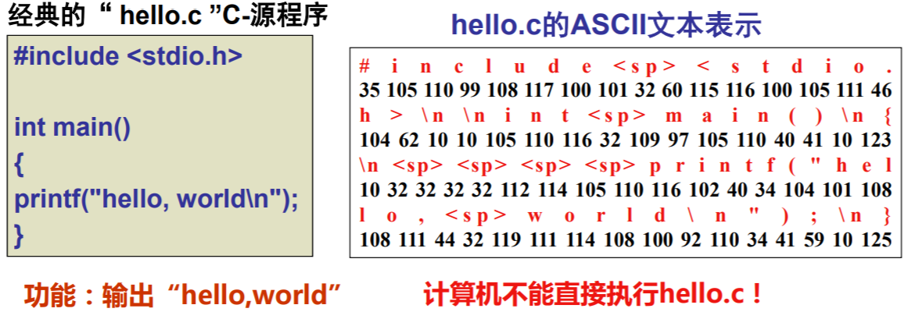
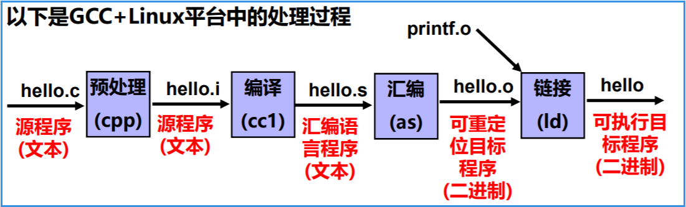

## 1.  程序的表示、转换与链接

### 1.1  计算机系统基本组成与基本功能

#### 1.1.1 现代计算机的原型

1946年，普林斯顿高等研究院（the Institute for Advance Studyat Princeton，IAS ）开始设计“存储程序”计算机，被称为IAS计算机（1951年才完成，并不是第一台存储程序计算机，1949年由英国剑桥大学完成的EDSAC是第一台）。在那个报告中提出的计算机结构被称为<font color='red'>冯·诺依曼结构</font>

冯·诺依曼结构最重要的思想是"存储程序"

#### 1.1.2 工作方式

任何要计算机完成的工作都要先被编写成程序，然后将程序和原始数据送入主存并启动执行。一旦程序被启动，计算机应能在不需操作人员干预下，自动完成逐条取出指令和执行指令的任务。

 

早期，部件之间采用**分散方式**相连，现在，则大多采用**总线方式**相连

#### 1.1.3 冯诺依曼结构的主要思想

计算机应由**运算器**、**控制器**、**存储器**、**输入设备**和**输出设备**五个基本部件组成

各基本部件的功能是：

* 存储器不仅能存放数据，而且也能存放指令，形式上两者没有区别，但计算机应能区分数据还是指令；
* 控制器应能自动取出指令来执行
* 运算器应能进行加/减/乘/除四种基本算术运算，并且也能进行一些逻辑运算和附加运算
* 操作人员可以通过输入设备、输出设备和主机进行通信

内部以**二进制表示**指令和数据。每条指令由**操作码**和**地址码**两部分组成。操作码指出操作类型，地址码指出操作数的地址。由一串指令组成程序。

采用“存储程序”工作方式

**现代计算机结构模型**

 

**认识计算机中最基本的部件**

CPU：中央处理器；PC：程序计数器；MAR：存储器地址寄存器
ALU：算术逻辑部件；IR：指令寄存器；MDR：存储器数据寄存器
GPRs：通用寄存器组（由若干通用寄存器组成，早期就是累加器）

#### 1.1.4 计算机是如何工作的？

先想象一下妈妈是怎样做一桌你喜欢（指定）的菜的？
厨房-CPU，你妈-控制器，盘-GPRs，锅灶等-ALU ，架子-存储器

1、做菜前

* 原材料(**数据**)和菜谱(**指令**)都按序放在厨房外的架子(**存储器**)上， 每个架子有编号(**存储单元地址**)。
* 菜谱上信息：原料位置、做法、做好的菜放在哪里等，例如，把10、11号架上的原料一起炒，并装入3号盘
* 然后，我告诉妈妈从第5个架上(**起始PC=5**)指定菜谱开始做

2、开始做菜

* 第一步：从5号架上取菜谱（根据PC取指令）
* 第二步：看菜谱（指令译码）
* 第三步：从架上或盘中取原材料（取操作数）
* 第四步：洗、切、炒等具体操作（指令执行）
* 第五步：装盘或直接送桌（回写结果）
* 第六步：算出下一菜谱所在架子号6=5+1（修改PC的值）
* 继续做下一道菜（执行下一条指令）

如果你知道你妈妈是如何做菜的，你就已经知道计算机是如何工作的！

程序有指令组成(菜单由菜谱组成)

程序在执行前，数据和指令事先存放在存储器中，每条指令和每个数据都有地址，指令按序存放，指令由OP、ADDR字段组成，程序起始地址置PC

指令执行过程中，指令和数据被从存储器取到CPU，存放在CPU内的寄存器中，指令在IR中，数据在GPR中。

指令中需给出的信息：

* 操作性质（操作码）

* 源操作数1 或/和 源操作数2 （立即数、寄存器编号、存储地址）

* 目的操作数地址 （寄存器编号、存储地址）

存储地址的描述与操作数的数据结构有关！

**什么是计算机？**

计算机是一种能对数字化信息进行自动、高速算术和逻辑运算的处理装置

**计算机的基本部件及功能**

运算器（数据运算）：ALU、GPRs、标志寄存器等
存储器（数据存储）：存储阵列、地址译码器、读写控制电路
控制器（控制）：对指令译码生成控制信号
总线（数据传送）：数据(MDR)、地址(MAR)和控制线

<font color='green'>**计算机实现的所有任务都是通过执行一条一条指令完成的！**</font>

### 1.2 程序开发和执行过程简介

#### 1.2.1 最早的程序开发过程

**机器语言**

用机器语言编写程序，并记录在纸带或卡片上

穿孔表示0，未穿孔表示1，所有信息都是0/1序列！

 

太原始了，无法忍受？咋办？

用符号表示而不是0/1表示！

**汇编语言**

若用符号表示跳转位置和变量位置，是否简化了问题？

于是，汇编语言出现了， 用助记符表示操作码和寄存器，用标号表示位置

      

你认为用汇编语言编写的优点是：

* 不会因为增减指令而需要修改其他指令
* 不需记忆指令编码，编写方便
* 可读性比机器语言强

不过，这带来新的问题，是什么呢？

人容易理解了，但是机器不认识这些指令了？因此，需要将汇编语言转为机器语言！用汇编程序转换

#### 1.2.2 进一步认识机器级语言

汇编语言(源)程序由汇编指令构成，是由助记符和标号来表示的指令(与机器指令一一对应)

指令包含操作吗和操作数或其地址码(机器指令用二进制表示，汇编指令用符号表示)，只能描述：取(或存一个数)，两个数加(或减、乘、除、与、或等)，根据运算结果判断是否转移执行

想象用汇编语言编写复杂程序是怎样的情形？

例如，用汇编语言实现排序（sort）、矩阵相乘，需要描述的细节太多了，程序会很长很长，而且在不同结构上的机器就不能运行！

结论：用汇编语言比机器语言好，但是，还是太麻烦了。

**指令所能描述的功能**

对于以下结构的机器，你能设计出几条指令吗？

```
Ld M#，R# （将存储单元内容装入寄存器）
St R#，M# （将寄存器内容装入存储单元）
Add R#，M# （类似的还有Sub，Mul等；操作数还可“R#，R#”等）
Jxx M# （若满足条件，则转移到另一处执行）
```

#### 1.2.3 用高级语言开发程序

随着技术的发展，出现了许多高级编程语言

* 它们与具体机器结构无关
* 面向算法描述，比机器级语言描述能力强得多
* 高级语言中一条语句对应几条、几十条甚至几百条指令
* 有“面向过程”和“面向对象”的语言之分
* 处理逻辑分为三种结构：顺序结构、选择结构、循环结构
*  有两种转换方式：“编译”和“解释”
  * 编译程序：将高级语言源程序转换为机器级目标程序，执行时只要启动目标程序即可
  * 解释程序：将高级语言语句逐条翻译成机器指令并立即执行，不生成目标文件。

**一个典型程序的转换处理过程**

 

 

**Hello程序的数据流动过程**

 

数据经常在各存储部件间传送，故现代计算机大多采用“缓存”技术！

所有过程都是在CPU执行指令所产生的控制信号的作用下进行的。

#### 1.2.4 不同层次语言之间的等价转换

 

任何高级语言程序最终通过执行若干条指令来完成！

### 1.3 计算机系统层次结构

#### 1.3.1 开发和运行程序需什么支撑？

最早的程序开发很简单，直接输入指令和数据，启动后把第一条指令地址送PC开始执行

用高级语言开发程序需要复杂的支撑环境，表现如下：

* 需要编辑器编写源程序
* 需要一套翻译转换软件处理各类源程序

  * 编译方式：预处理程序、编译器、汇编器、链接器

  * 解释方式：解释程序
* 需要一个可以执行程序的界面(环境)
  * GUI方式：图形用户界面
  * CUI方式：命令行用户界面

支撑程序开发和运行的环境由系统软件提供，最重要的系统软件是操作系统和语言处理系统，语言处理系统运行在操作系统之上，操作系统利用指令管理硬件

语言处理程序<font color='red'>+</font>语言处理系统<font color='red'>—></font>语言的运行时系统<font color='red'>—></font>操作系统内核—>指令集体系结构<font color='red'>—></font>计算机硬件

**机器语言编程**：称为第一代程序设计语言，应用程序—>指令集体系结构—>计算机硬件

**汇编语言编程**：称为第二代程序设计语言，应用程序—>汇编程序—>操作系统—>指令集体系结构—>计算机硬件

**高级语言编程**：

* 第三代程序设计语言为过程式语言，编码时需要描述实现过程，即“如何做”。
* 第四代程序设计语言为非过程式语言，编程时只需说明“做什么”，不需要描述具体的算法实现细节。

​          **机器语言**                                   **汇编语言编程**                                     **高级语言编程**                       

                                  

可以看出，语言的发展是一个不断“抽象”的过程，因而，相应的计算机系统也不断有新的层次出现

语言处理系统包括：各种语言处理程序（如编译、汇编、链接）、运行时系统（如库函数，调试、优化等功能）

操作系统包括人机交互界面、提供服务功能的内核例程。

#### 1.3.2 计算机系统抽象层的转换

程序执行结果不仅取决于算法、程序编写，而且取决于语言处理系统、操作系统、ISA、微体系结构

功能转换：上层时下层的抽象，下层时上层的实现，底层为上层提供支撑环境！

 

#### 1.3.3 计算机系统的不同用户

最终用户工作在由应用程序提供的最上面的抽象层

系统管理员工作在由操作系统提供的抽象层

应用程序员工作在由语言处理系统(主要有编译器和汇编器)的抽象层

语言处理系统建立在操作系统之上

系统程序员(实现系统软件)工作在ISA层次，必须对ISA非常了解

编译器和汇编器的目标程序由机器级代码组成，操作系统通过指令直接对硬件进行编程控制

ISA是对硬件的抽象，所有软件功能都建立在ISA之上

 

#### 1.3.4 指令集体系结构

ISA指 `Instruction Set Architecture`，即指令集体系结构，有时简称为指令系统，它是一种规约(Specification)，规定了如何使用硬件

* 可执行的指令的集合，包括指令格式、操作种类以及每种操作对应的操作数的相应规定；
* 指令可以接受的操作数的类型；
* 操作数所能存放的寄存器组的结构，包括每个寄存器的名称、编号、长度和用途；
* 操作数所能存放的存储空间的大小和编址方式；
* 操作数在存储空间存放时按照大端还是小端方式存放；
* 指令获取操作数的方式，即寻址方式；
* 指令执行过程的控制方式，包括程序计数器(PC)，条件码定义等

<font color='red'>问题：ISA是在通用计算机系统中是必不可少的一个抽象层，Why？</font>

* 没有它，软件无法使用计算机硬件！
* 没有它，一台计算机不能称为“通用计算机

<font color='red'>问题：ISA和计算机组成(Organization，即MicroArchitecture)是何关系？</font>

不同ISA规定的指令集不同，如，IA-32、MIPS、ARM等，计算机组成必须能够实现ISA规定的功能，如提供GPR、标志、运算电路等，同一种ISA可以有不同的计算机组成，如乘法指令可用ALU或乘法器实现。

### 1.4 本课程的主要学习内容

#### 1.4.1 后PC时代计算机教学面临的挑战

后PC时代的几个特征

* 计算资源多样化，I/O设备无处不在，数据中心，PMD与PC等共存
* 软件和硬件协同设计(硬件、OS和编译器之间的关联更加密切)
* 对应用程序员的要求更高
  * 编写高效程序必须了解计算机底层结构
  * 必须掌握并行程序设计技术和工具
  * 应用问题更复杂，领域更广

“并行”成为重要主题、培养具有系统观的软/硬件贯通人才是关键！

#### 1.4.2 计算机系统抽象层的转换

计算机学科主要研究的是计算机系统各个不同抽象层的实现及其相互转换的机制

计算机学科培养的应该主要是在计算机系统或在系统某些层次上从事相关工作的人才

 

所有计算机专业课程基本上是围绕其中一个或多个不同抽象层开展教学！本课程为基础课程，试图通过讲解程序开发和执行来构建计算机系统总体框架

#### 1.4.3 计算机系统基础课程

从程序员角度出发来认识计算机系统

**教学目标**

培养学生的系统能力，使其成为一个“高效”程序员，在程序调试、性能提升、程序移植和健壮性等方面成为高手；建立完整的计算机系统概念，为后续的OS、编译、体系结构等课程打下坚实基础

以 IA-32+Linux+C+gcc 为平台（开源项目平台）

与[MOOC课程](https://www.coursera.org/course/hwswinterface)的想法类似

思路：在程序与程序的执行机制之间建立关联，强化理解而不是记忆

 

使学生清楚理解：计算机是如何生成和运行可执行文件的！

 

<font color='red'>**三个主题**</font>

* 表示
  * 不同数据类型（包括带符号整数、无符号整数、浮点数、数组、结构等）在寄存器或存储器中如何表示和存储？
  * 指令如何表示和编码（译码）？
  * 存储地址（指针）如何表示？如何生成复杂数据结构中数据元素的地址？
* 转换
  * 高级语言程序对应的机器级代码是怎样的？如何转换并链接生成可执行文件？
* 执行控制流
  * 计算机能理解的“程序”是如何组织和控制的？
  * 如何在计算机中组织多个程序的并发执行？
  * 逻辑控制流中的异常事件及其处理
  * – I/O操作的执行控制流（用户态→内核态）

前导知识：C语言程序设计

内容组织：分3门短课程

* 第一部分：程序的表示、转换与链接。
* 第二部分：程序的执行和存储访问。
* 第三部分：异常、中断和输入/输出。