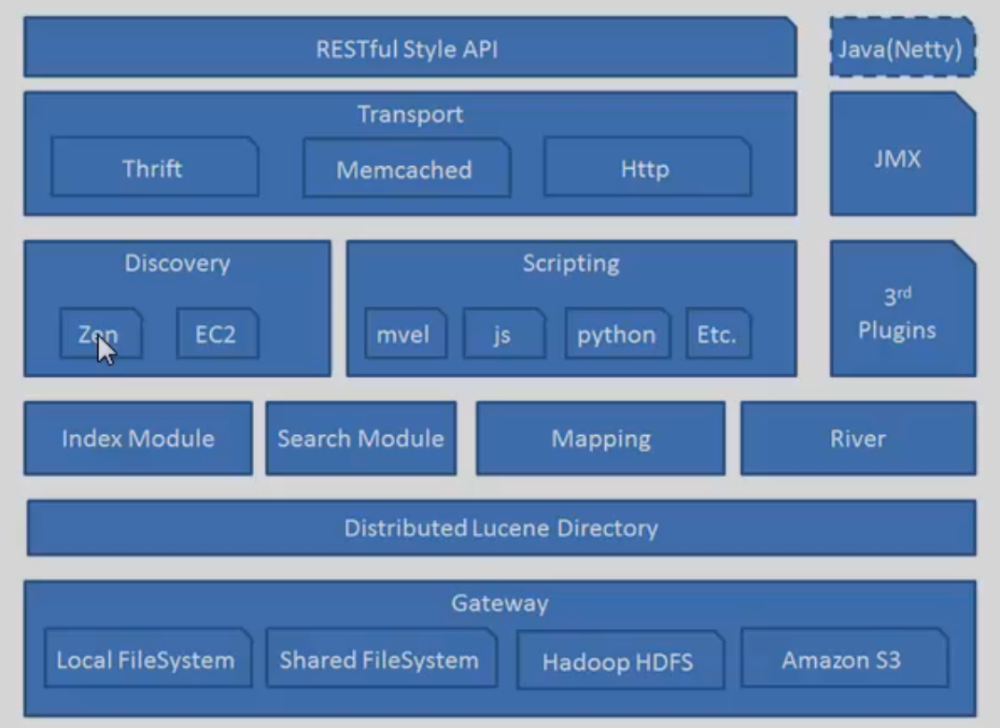
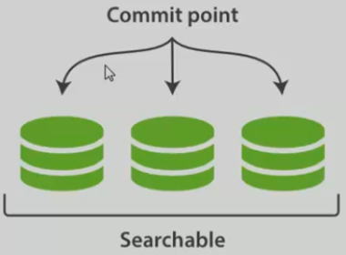
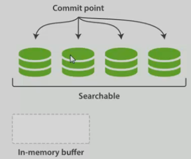
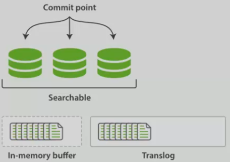
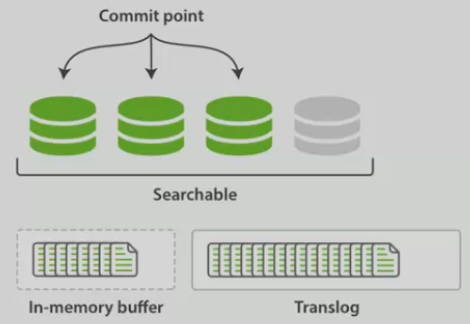
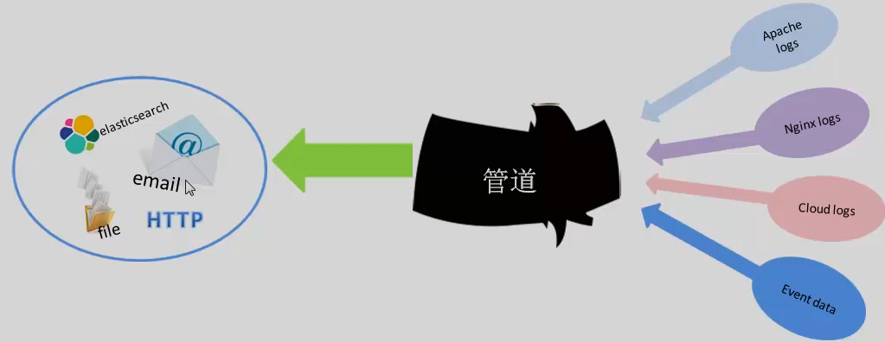
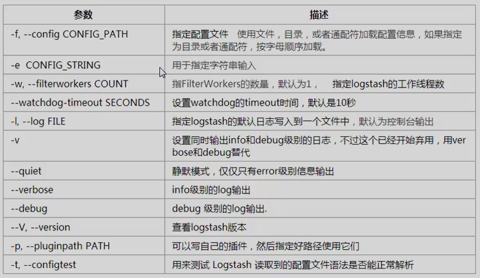

##  1. Elasticsearch概念

**定义**

ELK是当前比较流行的、开源的、日志分析解决方案

### 1.1 相关定义

一个采用Restful API 标准的高扩展性和高可用性的实时数据分析的全文搜索工具

* Node(节点)：单个的装有Elasticsearch服务并且提供故障转移和扩展的服务器
* Cluster(集群)：一个集群就是一个或者多个node组织在一起，共同工作，共同分享整个数据具有负载均衡功能的集群。
* Document(文档)：一个文档就是一个可被索引的基础信息单元
* Index(索引)：索引就是一个拥有几分相似特征的文档的集合
* Type(类型)：一个索引中，你可以定义一种或多种类型
* Field(列)：Field是Elasticsearch的最小单位，相当于数据的某一列
* Shards(分片)：Elasticsearch将索引分成若干份，每个部分就是一个shard
* Replicas(复制)：Replicas是索引一份或多份拷贝

| 关系型数据库（比如Mysql） | 关系型数据库（Elasticsearch） |
| ------------------------- | ----------------------------- |
| 数据库 Database           | 索引 Index                    |
| 表 Table                  | 类型 Type                     |
| 数据行 Row                | 文档Document                  |
| 数据列 Column             | 字段 Field                    |

### 1.2 Elasticsearch架构




## 2 . RESTFul以及CURL的介绍

### 2.1 什么是RESTFul

API：Application Programming Interface的缩写，中文意思即应用程序接口

XML：可扩展标记语言，是一种程序与程序之间传输数据的标记语言

JSON：英文javascript object notation的缩写，它是一种新型的轻量级数据交换格式 

**RESTFul的具体含义**

* 英文Representational State Transfer缩写
* 中文意思是"表现层状态转化"

资源：

* GET：用来获取资源
* POST：用来新建资源（也可以用于更新资源）
* PUT：用来更新资源
* DELETE：用来删除资源

### 2.2 CURL命令的讲解

* 就是以命令的方式来执行HTTP协议的请求的工具
* 可以通过CURL操作HTTP的GET/POST/PUT/DELETE方法

**CURL相关操作**

* 访问一个网页：

  ```shell
  curl www.baidu.com
  ```

* 显示http response的头信息

  ```shell
  curl -i www.baidu.com
  ```

* 显示一次http请求的通信过程

  ```shell
  curl -v www.baidu.com
  curl --trace output.txt www.baidu.com
  ```

* CURL执行GET/POST/PUT/DELETE操作

  ```shell
  curl -X GET/POST/PUT/DELETE www.example.com
  ```

### 2.3 Elasticsearch API文档查看

https://www.elastic.co/guide/en/elasticsearch/reference/current/docs.html


## 3. 安装以及相关插件的介绍

### 3.1 Elasticsearch安装

确认现有JDK版本

```shell
# java -version
```

安装以及配置环境变量

```shell
# tar zxvf jdk-8u60-linux-x64.tar.gz
# vim /etc/profile
```

```shell
export JAVA_HOME=/opt/jdk...
export JAVA_BIN=/opt/jdk.../bin
export PATH=$PATH:$JAVA_HOME/bin
export CLASSPATH=.:$JAVA_HOME/lib/dt.jar:$JAVA_HOME/lib/tools.jar
export JAVA_HOME JAVA_BIN PATH CLASSPATH
```

确认安装

```shell
# java -version
```

启动命令

```shell
./bin/elasticsearch -d (-d 参数是为了让服务后台启动)
```

Web服务地址

```shell
http://localhost:9200
```

Elasticsearch目录结构

| 文件夹   | 作用                                                  |
| -------- | ----------------------------------------------------- |
| /bin     | 运行Elasticsearch实例和管理插件的一些脚本             |
| /config  | 配置 文件路径，包含elasticsearch.yml                  |
| /data    | 在节点上每个索引/碎片的数据文件的位置，可以有多个目录 |
| /lib     | Elasticsearch使用的库                                 |
| /logs    | 日志的文件夹                                          |
| /plugins | 已经安装的插件的存放位置                              |

### 3.2 相关插件

Head 插件介绍

Head插件是一个elasticsearch的集群管理工具，它是完全由html5编写的独立网页程序

Bigdesk插件介绍

bigdesk是elasticsearch的一个集群监控工具，可以通过它来查看集群的各种状态，如：cpu、内存使用情况，索引数据、搜索情况，http连接数等。


## 4. 倒排索引

**什么是倒排索引？**

维基百科：倒排索引（英语：Inverted index），也常被称为反向索引、置入档案或反向档案，是一种索引方法，被用来存储在全文搜索下某个单词在一个文档或者一组文档中的存储位置的映射。它是文档检索系统中最常用的数据结构。

**常规的索引建立方式**

文档->关键词的映射过程（正向索引） 缺点：费时，得把这个文档全部遍历一遍

**倒排反向建立索引**

关键词->文档的映射 把正向索引的结果重新构造成倒排索引（反向索引）


## 5. API CURD操作

### 5.1 索引文档化

**Mavel插件**

Marcel也是Elasticsearch的一个管理监控工具，集head和bigdesk优点为一身。但是Marvel插件不是免费的

### 5.1 索引文档API CURD

**1. 索引初始化操作**

创建索引之前，可以对索引作初始化操作，比如指定shards数量以及replicas的数量

```json
CURL -XPUT 'http://192.168.1.10:9200/library/'-d'{
"setting":"index":{
    "number_of_shards":5,
    "number_of_replicas":1
		}
	}
}
```

上面的number_of_replicas还可以换成：

* blocks.read_only：设为true，则当前索引只允许读，不允许写或更新
* blocks.read：设为true，则禁止读操作
* blocks.write：设为true，则禁止对metadata操作

**2. 查看索引**

可以通过GET带上参数_settings可以获得该索引详细的配置信息

```shell
GET /library/_settings
```

同时获取两个索引的信息

```shell
GET /library,library2/_settings
```

获得所有索引的信息

```shell
GET /_all/_settings
```

创建一个索引

```json
PUT /library/books/2 # 索引名称/Type名称/文档ID
{
    "title":"Elasticsearch:The Definitive Guide007",
    "name":{
        "first":"zachary",
        "last":"long"
	},
    "publish_date":"2019-09-16",
    "price":"50.29"
}
```

文档ID也可以选择不设置，通过ID获得文档信息

```shell
GET /library/books/1
GET /library/books/2
```

通过_source获取指定的字段

```shell
GET /library/books/1?_source=title
GET /library/books/2?_source=title,name
GET /library/books/1?_source
```

**3. 更新内容**

我们更新同一个ID下的文档，可以通过覆盖的方式更新

```json
PUT /library/books/1
{
    "title":"Elasticsearch:The Definitive Guide",
    "name":{
        "first":"zachary",
        "last":"long"
	},
    "publish_date":"2019-09-16",
    "price":"80.29"
}
GET /library/books/1
```

或者通过 _update API 的方式单独更新你想要更新的

```json
POST /library/books/1/_update
{
    "doc":{
        "price":10
    }
}
POST /library/books/1/_update
{
    "doc":{
        "title":"fly"
    }
}
GET /library/books/1
```

**4. 删除文档**

```shell
DELETE /library/books/1
DELETE /library/books
DELETE /library
GET /library
```

**Elasticsearch的内置字段以及类型**

| 内置字段 | \_uid,\_id,\_type,\_source,\_all,\_analyzer,\_boost,\_parent,\_routing,\_index,\_size,\_timestamp,\_ttl |
| -------- | ------------------------------------------------------------ |
| 字段类型 | String，Integer/long，Float/double，Boolean，Null，Date      |

## 6. Mget获取多个文档

**介绍 Mulit GET API**

为了更快更迅速的同时检索多个文档

mget API参数是一个docs数组，数组的每个节点定义一个文档的\_index、\_type、\_id元数据

同时获取多个文档信息，例如，获取index：bank和shakespeare下面ID为1,2,3的文档信息

```json
GET /_mget
{
    "docs":[
        {
            "_index":"bank",
            "_type":"bank-account"，
            “_id": 1  
        },
        {
            "_index":"bank",
            "_type":"bank-account"，
            “_id": 2  
        },
            "_index":"shakespeare",
            "_type":"line"，
            “_id": 3  
    ]
}
```

也可以指定_source字段，获取你想要的

```json
GET /_mget
{
    "docs":[
        {
            "_index":"shakespeare",
            "_type":"line",
            "_id":6,
            "_source":"play_name"
        },
                {
            "_index":"shakespeare",
            "_type":"line",
            "_id"28,
            "_source":"play_name"
        },
    ]
}
```

指定多个_source字段，数组的形式[]

```json
GET /_mget
{
    "docs":[
        {
            "_index":"shakespeare",
            "_type":"line",
            "_id":6
        },
        {
            "_index":"shakespeare",
            "_type":"line",
            "_id":28,
            "_source":["play_name","speaker","text_entry"]
        }
    ]
}
```

获取相同index相同type下不同ID的文档

```json
GET /shakespeare/line/_mget
{
    "ids":["6","28"]
}
```

## 7. 批量操作bulk

### 7.1 介绍

**介绍bulk批量操作API**

为了实现多个文档的create、index、update或delete

**请求体格式**

{action:{metadata}}\n

{request body}\n

{action:{metadata}}\n

{request body}\n

...

例：{“delete":{"\_index":"library","\_type":"books","_id":"1"}}

| action | 解释                     |
| ------ | ------------------------ |
| create | 当文档不存在时创建之     |
| index  | 创建新文档或替换已有文档 |
| update | 局部更新文档             |
| delete | 删除一个文档             |

批量操作bulk

```json
POST /library/books/_bulk
{"index":{"_id":1}}
{"title":"Elasticsearch: The Definitive Guide","price":5}
{"index":{"_id":2}}
{"title":"The Elasticsearch cookbook","price":15}
{"index":{"_id":3}}
{"title":"The Elasticsearch Blueprints","price":9}
GET /library/
GET /library/books/_mget
{
    "ids":["1","2","3"]
}
```

当然还可以有delete，update等操作，注意delete下面没有具体的request body

```json
POST /library/books/_bulk
{"delete":{"_index":"library","_type":"books","_id":"1"}}
{"create":{"_index":"music","_type":"classical","_id":"1"}}
{"title":"Ave Verum Corpus"}
{"index":{"_index":"music","_type":"classical"}}
{"title":"Litaniac de Venerabili Altaris Sacromento"}
{"update":{"_index":"library","_type":"books","_id":"2"}}
{"doc":{"price":"18"}}
```

### 7.2 bulk处理文档大小的最佳量

* 数据加载在每个节点里的RAM里
* 请求的数据超过一定的大小，那bulk的处理性能就会降低
* 文档数据大小跟硬件配置，文档复杂度，以及当前集群的负载有关


## 8. 版本控制

### 8.1 为什么要进行版本控制

防止数据读取的不一致性

### 8.2 悲观锁和乐观锁

* 悲观锁：假定会发生并发冲突，屏蔽一切可能违反数据完整性的操作
* 乐观锁：假设不会发生并发冲突，只在提交操作时检查是否违反数据完整性

### 8.3 内部版本控制和外部版本控制

* 内部版本控制：\_version自增长，修改数据后，_version会自动加1
* 外部版本控制：为保持_version 与外部版本控制的数值一致，使用 version_type=external，检查数据当前的version值是否小于请求中的version值

## 9. Mapping 映射

### 9.1 什么是映射

映射：创建索引的时候，可以预先定义字段的类型以及相关属性

作用：这样会让索引建立得更加的细致和完善！

分类：**静态映射**和**动态映射**

### 9.2 映射的属性方法

除了定义字段的类型，还可以给字段添加相关的属性

| 属性            | 描述                                                         | 适用类型                                     |
| --------------- | ------------------------------------------------------------ | -------------------------------------------- |
| store           | 值为：yes或者no 设为yes就是存储，no就是不存储                | all                                          |
| index           | 值为：analyzed，not_analyzed或者no<br />analyzed索引且分析<br />not_analyzed索引但是不分析<br />no不索引这个字段，这样就搜不到<br />默认值是analyzed | string<br />其他类型只能设为no或not_analyzed |
| null_value      | 如果字段是空值，通过它可以设置一个默认值，比如“null_value":"NA" | all                                          |
| boost           | 设置字段的权值，默认值是1.0                                  | all                                          |
| index_analyzer  | 设置一个索引时用的分析器                                     | all                                          |
| search_analyzer | 设置一个搜索时用的分析器                                     | all                                          |
| analyzer        | 可以设置索引和搜索时用的分析器，默认Elasticsearch使用的是standard分析器，除此之外，你还可以使用whitespace、simple或English这三种内置的分析器 | all                                          |
| include_in_all  | 默认下Elasticsearch会为每个文档定义一个特殊的域_all，它的作用就是每一个字段都将被搜索到，如果不是的话，就在这字段定义一个include_in_all=false;默认值是true | all                                          |
| index_name      | 定义字段的名称；默认值是字段本身的名字                       | all                                          |
| norms           | norms的作用是根据各种规范化因素去计算权值，这样方便查询；在analyzed定义字段里，值是true，not_analyzed是false | all                                          |

### 9.3 动态映射

* 什么是动态映射？

  文档中碰到一个以前没见过的字段时，动态映射可以自动决定该字段的类型，并对该字段添加映射。

* 如何配置动态映射？

  通过dynamic属性进行控制

  true：默认值，动态添加字段；false：忽略新字段；strict：碰到陌生字段，抛出异常。

* 适用范围？

  适用在根对象上或者object类型的任意字段上

```json
# 建立映射
POST /library
{
    "settings":{
        "number_of_shards":5,
        "number_of_replicas":1
    },
    "mappings":{
        "books":{
            "properties":{
                "title":{"type":"string"},
                "name":{"type":"string","index":"not_analyzed"},
                "publish_date":{“type":"date","index":"not_analyzed"},
                "price":{"type":"double"},
                "number":{"type":"integer"}
            }
        }
    }
}
```

```json
PUT /library
{
    "mappings":{
        "books":{
            "dynamic":"strict",
            "properties":{
                "title":{"type":"string"},
                "name":{"type":"string","index":"not_analyzed"},
                "publish_date":{"type":"date","index":"not_analyzed"},
                "price":{"type":"double"},
                "number":{
                    "type":"object",
                    "dynamic":true
                }
            }
        }
    }
}
```

### 9.4 管理映射

* 获取映射信息

  ```json
  # GET /library/
  获取某个索引的映射信息
  GET /bank/_mapping/
  # 获取某个索引下某个type的映射信息
  GET /_all/_mapping
  # 获取这个集群内所有的映射信息
  GET /_all/_mapping
  # 获取这个集群内某两个或多个type的映射信息
  ```

* 更新映射信息

  更新修改Mapping映射，很遗憾，mapping一旦建立，就不能修改现有的字段映射，如果要推倒现有的映射，你得重新建立一个索引，然后重新定义映射，然后把之前索引里的数据导入新建立的映射里

  具体方法：

  1. 给现有的索引定义一个别名，并且把现有的索引指向这个别名，运行步骤2
  2. 运行：PUT/现有索引/_alias/别名A
  3. 新创建一个索引，定义好最新的映射
  4. 将别名指向新的索引，并且删除之前索引的执行，运行步骤5
  5. 运行：POST /_aliases

  ```json
  {
      "actions":[
          {"remove":{"index":"现有索引名", ”alias":"别名A"}},
           {"add":{"index":"新建索引名","alias":"别名A"}}
      ]
  }
  ```

* 删除映射信息

```shell
DELETE /library/books
DELETE /library/books/_mapping
DELETE /library/_mapping/books
```

## 10. 查询

Elasticsearch是功能非常强大的全文搜索引擎，用它的目的就是为了能快速的查询你想要的数据。

基本查询：利用Elasticsearch内置查询条件进行查询

组合查询：把多个基本查询组合在一起的复合性查询

过滤：查询同时，通过filter条件在不影响打分的情况下筛选出想要的数据

### 10.1 基本查询

查看测试数据

```json
GET /library/books/_mget
{
    "ids":["1","2","3","4","5","6","7","8"]
}
```

查看library的mapping信息

```shell
GET /library/_mapping
```

查看shakespeare的mapping信息

```shell
GET /shakespeare/_mapping
```

简单查询

* 指定index名以及type名的搜索

  ```shell
  GET /library/books/_search?q=title:elasticsearch
  ```

* 指定index名没有type名的搜索

  ```shell
  GET /library/_search?q=title:mongodb
  ```

* 既没有index名也没有type名的搜索

  ```shell
  GET /_search?q=title:elasticsearch
  ```

* term，terms查询

  term查询：查询某字段里有某个关键词的文档

  ```json
  GET /library/books/_search
  {
      "query":{
          "term":{
              "preview":"elasticsearch"
          }
      }
  }
  ```

  terms查询，查询某个字段里有多个关键词的文档

  minimum_match：最小匹配集：1.说明两个关键词里最少有一个，2 就说明文档里这两个关键词都得存在

  ```json
  GET /lbrary/books/_search
  {
      "query":{
          "term":{
              "preview":["elasticsearch","book"],
              "minimum_match":1
          }
      }
  }
  ```

* from，size

  控制查询返回的数量

  相当于mysql里的limit

  from：从哪个结果开始返回

  size：定义返回最大的结果数

  ```json
  GET /library/books/_search?q=title:elasticsearch
  GET /library/books/_search
  {
      "from":1,
      "size":2,
      "query":{
           "term":{
          "title":"elasticsearch"
           }   
      }
  }
  ```

* 返回版本号 _version

  ```json
  GET /library/books/_search
  {
      "version":true,
      "query":{
          "term":{
              "preview":"elasticsearch"
          }
      }
  }
  ```

* match查询

  match查询可接受文字，数字日期等数据类型

  match跟term的区别是，match查询的时候，Elasticsearch会根据你给定的字段提供合适的分析器，而term查询不会有分析器分析的过程

  ```json
  GET /library/books/_search
  {
      "query":{
          "match":{
              "preview":"elasticsearch"
          }
      }
  }
  GET /library/books/_search
  {
      "query":{
          "match":{
              "price":11
          }
      }
  }
  ```

  通过match_all查询指定索引下的所有文档

  ```json
  GET /library/books/_search
  {
      "query":{
          "match_all":{}
      }
  }
  ```

  通过match_phrase查询

  短语查询，slop定义的是关键词之间隔多少未知单词

  ```json
  GET /library/books/_search
  {
      "query":{
          "match_phrase":{
              "preview":{
                  "query":"elasticsearch,distributed",
                  "slop":2
              }
          }
      }
  }
  ```

  multi_match查询

  可以指定多个字段

  比如查询title和preview这两个字段里都包含Elasticsearch关键词的文档

  ```json
  GET /library/books/_search
  {
      "query":{
          "multi_match":{
              "query":"Elasticsearch",
              "fields":["title","preview"]
          }
      }
  }
  ```

  指定返回的字段

  注意只能返回store为yes的字段

  ```json
  GET /library/books/_search
  {
      "fields":["preview"],
      "query":{
          "match":{
              "preview":"elasticsearch"
          }
      }
  }
  ```

  通过partial_fields控制加载的字段

  ```json
  GET /library/books/_search
  {
      "partial_fields":{
          "partial":{
              "include":["preview"],
              "exclude":["title,price"]
          }
      },
      "query":{
          "match_all":{}
      }
  }
  ```

* 升序降序

  通过sort把结果排序

  desc：降序

  asc：升序

  ```json
  GET /library/books/_search
  {
      "query":{
          "match_all":{}
      },
      "sort":[
          {
              "price":{
                  "order":"desc"
              }
          }
      ]
  }
  ```

* prefix前缀匹配查询

  ```json
  GET /library/books/_search
  {
      "query":{
          "prefix":{
              "title":{
                  "value":"r"
              }
          }
      }
  }
  ```

* range范围查询

  有from，to，include_lower，include_upper，boost这些参数

  include_lower：是否包含范围的左边界，默认是true

  include_upper：是否包含范围的右边界，默认是true

  ```json
  GET /library/books/_search
  {
      "query":{
          "range":{
              "publish_date":{
                  "from":"2015-01-01",
                  "to":"2015-06-30"
              }
          }
      }
  }
  GET /library/books/_search
  "query":{
      "range":{
          "price":{
              "from":"10",
              "to":"20",
              "include_lower":true,
              "include_upper":false
          }
      }
  }
  ```

* wildcard通配符查询

  允许你使用通配符* 和？ 来进行查询

  \*  就代表一个或多个字符

  ？代表一个字符

  注意：该查询很影响性能

  ```json
  GET /library/books/_search
  {
      "query":{
          "wildcard":{
              "preview":"rab*"
          }
      }
  }
  ```

* fuzzy模糊查询

  value：查询的关键字

  boost：设置查询的权值，默认是1.0

  min_similarity：设置匹配的最小相似度

  默认值为0.5；对于字符串，取值为0-1（包括0和1）：对于数值，取值可能大于1；对于日期型，取值为1d，2d，1m这样，1d就代表一天。

  prefix_length：指明区分词项的共同前缀长度，默认是0

  max_expansions：指明查询中的词项可扩展的数目，默认可以无限大。

  ```json
  GET /library/books/_search
  {
      "query":{
          "fuzzy":{
              "preview":"rabit"
          }
      }
  }
  GET /library/books/_search
  {
      "query":{
          "fuzzy":{
              "preview":{
                  "value":"rabit",
                  "min_similarity":0.5
              }
          }
      }
  }
  ```

  fuzzy_like_this：查询得到与给定内容相似的所有文档

  fields：字段组，默认是_all

  like_text：设置关键词

  ignore_tf：设置忽略词项的频次，默认是false

  max_query_terns：指明在生成的查询中查询词项的最大数目，默认是25

  min_similarity：指明区分词项共同前缀的长度，默认是0

  boost：设置权值，默认是1.0

  analyze：指明用于分析给定内容的分析器

  ```json
  GET /library/books/_search
  {
      "query":{
          "fuzzy_like_this":{
              "fields":["preview"],
              "like_text":"open source software",
              "min_similarity":0.5,
              "prefix_length":0.2
          }
      }
  }
  ```

  fuzzy_like_this_field查询

  只作用在一个字段里

  其他与fuzzy_like_this功能一样

  ```json
  GET /library/books/_search
  {
      "query":{
          "fuzzy_like_this_field":{
              "preview":{
                  "like_text":"open source software",
                  "min_similarity":0.5,
                  "prefix_length":0.2
              }
          }
      }
  }
  ```

* more_like_this

  fields：定义字段组，默认是_all

  like_text：定义要查询的关键词

  percent_terms_to_match：该参数指明一个文档必须匹配多大比例的词项才被视为相似。默认值是0.3，意思是30%的比例

  min_term_freq：该参数指明在生成的查询中查询词项的最大数目。默认为25

  stop_words：该参数指明将被忽略的单词集合

  min_doc_freq：该参数指明词项应至少在多少个文档中出现才不会被忽略。默认是5

  max_doc_freq：该参数指明单个单词的最大长度，高于该值的单词将被忽略，默认是无限大

  boost_terms：该参数指明提升每个单词的权重时使用的权重，默认是1

  boost：指明提升一个查询的权值，默认是1.0

  analyer：指定用于分析的分析器

  ```json
  GET /library/books/_search
  {
      "query":{
          "more_like_this":{
              "fields":["preview"],
              "like_text":"Apache open source",
              "min_term_freq":1,
              "min_doc_freq":1
          }
      }
  }
  ```

* more_like_this_field查询

  只作用在一个字段里

  其他与more_like_this功能一样

  

## 11. Filter过滤

### 11.1 filter查询语句

建立测试数据

```json
POST /store/products/_bulk
{"index":{"_id":1}}
{"price":10,"productID":"SD1002136"}
{"index":{"_id":2}}
{"price":20,"productID":"SD2678421"}
{"index":{"_id":3}}
{"price":30,"productID":"SD8897573"}
{"index":{"_id":4}}
{"price":40,"productID":"SD4535233"}
```

查看测试数据

```json
GET /store/products/_mget
{
    "ids":["1","2","3","4"]
}
```

查看library的mapping信息

```json
GET /store/_mapping
```

**简单过滤查询**

SELECT document FROM products WHERE price =20 or price=10

filtered 查询价格是20或10的商品

```json
GET /store/products/_search
{
    "query":{
        "filtered":{
            "query":{
                "match_all":{}
            },
            "filter":{
                "term":{
                    "price":[10,20]
                }
            }
        }
    }
}
```

SELECT product FROM products WHERE productID="SD4535233"

```json
GET /store/products/_search
{
    "query":{
        "filtered":{
            "filter":{
                "term":{
                    "productID":"SD4535233"
                }                
            }
        }
    }
}
```

查看分析器解析的结果

```json
GET /_analyze?text=SD4535233
GET /store/_mapping
DELETE /store
```

重新建立一个映射，让productID处于not_analyzde模式

```json
PUT /store
{
    "mappings":{
        "products":{
            "properties":{
                "productID":{
                    "type":"string",
                    "index":"not_analyzed"
                }
            }
        }
    }
}
```

bool过滤查询，可以做组合过滤查询

SELECT product FROM products WHERE (price =20 OR productID="SD1002136") AND (price !=30)

查询价格等于20的或者productID为SD4535233的商品，排除价格30元的。

类似的，ELasticsearch也有and，or，not这样的组合条件的查询方式

格式如下：

```json
{
    "bool":{
        "must":[],
        "should":[],
        "must_not":[],
    }
}
```

must：条件必须满足，相当于and

should：条件可以满足也可以不满足，相当于or

must_not：条件不需要满足，相当于not

```json
GET /store/products/_search
{
    "query":{
        "filter":{
            "bool":{
                "should":[
                    {"term":{"price":20}},
                    {"term":{"productID":"SD1002136"}}
                ],
                "must_not":{
                    "term":{"price":30}
                }
            }
        }
    }
}
```

**嵌套查询**

SELECT document FROM products WHERE productID="SD1002136" OR (productID="SD4535233" AND price=30)

```json
GET /store/products/_search
{
    "query":{
        "filterd":{
            "filter":{
                "bool":{
                    "should":[
                        {"term":{"productID":"SD1002136"}},
                        {"bool":{
                            "must":[
                                {"term":{"productID":"SD4535233"}},
                                {"term":{"price":30}}
                            ]
                        }}
                    ]
                }
            }
        }
    }
}
```

另外一种 and，or，not查询，没有bool，直接使用and，or，not

查询价格既是10元，product又为SD1002136的结果

```json
GET /store/products/_search
{
    "query":{
        "filtered":{
            "filter":{
                "and":[
                    {
                        "term":{
                            "price":10
                        }
                    },
                    {
                        "term":{
                            "productID":"SD1002136"
                        }
                    }
                ]
            },
            "query":{
                "match_all":{}
            }
        }
    }
}
```

**range范围过滤**

SELECT document FROM products WHERE price BETWEEN 20 AND 40

gt：> 大于

lt：< 小于

gte：>= 大于等于

lte：<= 小于等于

```json
GET /store/products/_search
{
    "query":{
        "filtered":{
            "filter":{
                "range":{
                    "price":{
                        "gte":20,
                        "lt":40
                    }
                }
            }
        }
    }
}
```

**过滤空和非空**

处理空值的方法

SELETE tags FROM test WHERE tags IS NOT NULL

SELETE tags FROM test WHERE tags IS NULL

```json
GET /test_index/test/_search
{
    "query":{
        "filtered":{
            "filter":{
                "exists":{"field":"tags"}
            }
        }
    }
}

{
    "query":{
        "filtered":{
            "filter":{
                "missing":{"field":"tags"}
            }
        }
    }
}
```

### 11.2 cache缓存

Elasticsearch在执行带有filter查询时，会打开索引的每个segment文件（Lucene式底层文件），然后去判断里面的文档是否符合filter要求

注意：旧的segment文件不会变，新来的数据会产生新的segment

匹配的结果会用一个大型的BigSet数组来存储，这个数组的值只有0和1

匹配：1

不匹配：0

BigSet是存在内存里的，而不是硬盘里，所以速度快！

开启方式：在filter查询语句后面加上“_cache”：true

注意：

Scriptfilters，Geo-filters，Date ranges这样的过滤方式开启cache无意义

exist，missing，range，term和terms查询时默认开启cache的


## 12. 组合查询

### 12.1 bool查询

* must，should，must_not
* minimum_should_match：表示一个文档至少匹配多少个短语才算是匹配成功
* disable_coord：启用和禁用一个文档中所包含所有查询关键词的分数得分计算，默认是false

**无Coordination效果**

含有apple的文档 -> 分值：1.5

含有apple jobs的文档 -> 分值：3.0

含有 apple jobs mobile 的文档 -> 分值：4.5

**有Coordination效果**

含有apple的文档 ->分值：1.5*1/3=0.5

含有apple jobs的文档 -> 分值：3.0*2/3=2.0

含有apple jobs moblie 的文档 ->分值：4.5*3/3=4.5

### 12.2 boosting查询

positive部分：查询返回的查询结果分值不变

negative部分：查询的结果分值会被降低

negative_boost部分：设置negative中要降低的分值

**Boosting查询的优点**

优点：里面的两个查询都会有结果返回，其中一个分值就是你设置的分值

注意：如果设有bool的must_not的话，那降低的那部分就没有结果返回

```json
GET /_search
{
    "query":{
        "boosting":{
            "positive":{
                "match":{
                    "text":"apple"
                }
            },
            "negative":{
                "match":{
                    "text":"fruit pie tart red sweet"
                }
            },
            "negative_boost":0.5
        }
    }
}
```

### 12.3 constant_score查询

优点：可以让一个查询得到一个恒定的分值

```json
GET /libarary/books/_search
{
    "query":{
        "term":{
            "title":"elaticsearch"
        }
    }
}
GET /library/books/_search
{
    "query":{
        "constant_score":{
            "query":{
                "term":{
                    "title":"elasticsearch"
                }
            }
        }
    }
}
```

### 12.4 indices查询

优点：可以在多个索引上进行查询

no_match_query：查询其它索引里的数据

```json
GET /_search
{
    "query":{
        "indices":{
            "indices":["library"],
            "query":{
                "term":{
                    "title":"elasticsearch"
                }
            },
            "no_match_query":{
                "term":{
                    "price":10
                }
            }
        }
    }
}
```

## 13 索引原理

### 13.1 数据映射

* es实现实时索引的原理

  * Lucene把每次生成的倒排索引，叫做一个段（segment）  。然后另外使用一个commit文件，记录索引内所有的segment。而生成segment的数据来源，则是内存中的buffer。
  * 新收到的数据写到新的索引文件里

 

  * segment刷新到文件系统缓存
  * 默认1s间隔
  * 主动调用/_refersh接口刷到缓存
  * refresh_interval设置

**磁盘同步的translog控制**

* segment从文件系统缓存刷新到磁盘，更新commit
* 清空translog
* 默认30分钟间隔，或512MB阈值
* 主动调用/_flush接口
* index.translog.flush_threshold_size参数
* index.translog.flush_threshold_ops参数

 

**translog的一致性控制**

* 每5秒会强制刷新translog日志到磁盘上
* index.gateway.local.sync参数
* **无副本的时候，故障可能导致5s的数据丢失**


* mapping在新增字段时，节点和集群之间的差异可能性
* 主要数据类型介绍
* 动态mapping设置
* _type的field mapping冲突可能性
* multi-fields介绍（.raw的运用）
* meta fields介绍

### 13.2 内存策略

### 13.3 模板设置

### 13.4 磁盘控制

### 13.5 性能测试


## 15 Logstash原理

### 15.1 Logstash 介绍以及初步安装

#### 15.1 什么是ELK？

ELK：开源分布式日志分析搜索平台

E：Elasticsearch，它负责数据的存储和查询

L：logstash，它负责日志的过滤和解析

K：Kibana，它负责web方式的前端展现

#### 15.2 为什么要使用ELK？

* 传统获取和分析日志的方法繁琐而且不高效
* 使用ELK能灵活过滤日志
* 使用ELK能实时分析日志
* 使用ELK能直观的展现分析的结果

#### 15.3 什么是Logstash

Logstash is a data pipeline that helps you process logs and other event from a variety of sysytems.

**Logstash特性**

* Centralize data processing of all types 能集中处理各种类型的数据
* Normalize varying schema and formats 能标准化不同模式和格式的数据
* Quickly extend to custom log formats 能快速的扩展自定义日志的格式
* Easily add plugins for custom data sources 能非常方便的添加插件来定义数据来源

**中文解释**

它是一个由JRuby语言编写的运行在java虚拟机上的具有收集，分析和转发数据流功能的工具



#### 15.4 Logstash安装和初步使用

1. 安装好JDK

2. 源码包方式安装

   直接下载logstash-6.2.3.tar.gz解压运行

3. Yum方式安装

   rpm --import http://packages.elasticsearch.org/GPG-KEY-elasticsearch

   yum clean all

   yum install logstash

**Logstash运行参数**



### 15.2 Logstash配置语法以及插件

#### 15.2.1 配置语法

* 处理输入的input
* 处理过滤的filter
* 处理输出的output

完整的配置语句：

```json
input {
    file {
    path => "/usr/palecur/log.txt"
    start_position => beginning
    }
    }
filter{
grok {
match => {"message" => "%{COMBINEDAPACHELOG}"}
}
geoip{
    source => "clientip"
}
}
output {
    elasticsearch {}
    stdout {}
}
```

**语法格式**

* 区域

  * logstash中，是用 {} 来定义区域的
  * 区域内，我们可以定义插件
  * 一个区域内是可以定义多个插件

* 数据类型（布尔值，字符串，数值，数组，哈希）

  * 布尔boolean：ssl_enable => true

  * 字节Bytes：my_bytes => "10MB" # 10485760bytes

  * 字符串String：name => "Hello world"

  * 数值Number：port => 514

  * 数组 Array：match => ["datetime","UNIX","ISO8601"]

  * 哈希Hash：

    ```json
    options => {
        key1 => "value1",
        key2 => "value2"
    }
    ```

  * 编码阶段：`codec：codec => "json"`
  * 密码型：`my_password => "password"`
  * 路径：`my_path => "/tmp/logstash"`
  * 注释：#

* 条件判断

  * ==(等于)，!=(不等于)，<(小于)，>(大于)，<=(小于等于)，>=(大于等于)
  * =~(匹配正则)，!~(不匹配正则)
  * in(包含)，not in(不包含)
  * and(与)，or(或)，nand(非也)，xor(非或)
  * ()：复合表达式，!()：对复合表达式结果取反

* 字段引用

  Logstash还支持变量内插，在字符串里使用字段引用的方法是这样：

  ```json
  output{
      statsd{
      increment => "apache.%{[response][status]}"
  	}
  }
  ```

* inputs 就是输入

* codecs 就是解码

* filters 就是过滤

* outputs 输出