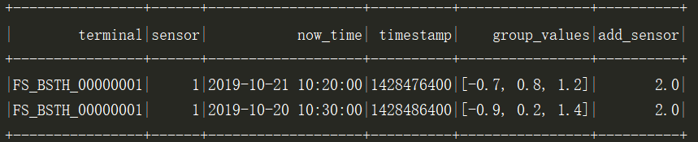

##  pyspark

### 1. dataframe简介

DataFrame是一种不可变的分布式数据集。Spark早期的API中，由于JVM和Py4J之间的通信开销，使用Python执行查询会明显变慢。

**Python到RDD之间的通信**

在PySpark驱动器中，Spark Context通过Py4J启动一个JavaSparkContext的JVM，所有的RDD转换最初都映射到Java中的PythonRDD对象。这样，Python和JVM之间就存在很多上下文切换和通信开销。

**利用DataFrame加速PySpark**

DataFrame和Catalyst优化器的意义在于和非优化的RDD查询比较时增加PySpark的性能，这种查询性能的提升源于降低了Python和JVM之间的通信开销。

### 2. DataFrame操作

#### 2.1 创建

通常情况下，使用SparkSession导入数据来创建DataFrame。

**字典方式**

通过字典方式生成的列是无序的，无法指定

```python
from pyspark.sql import SparkSession

spark_session=SparkSession.builder.appName("My App").config("spark.some.config.option","some-value").getOrCreate()
column_dt=[
    {"terminal":"FS_BSTH_00000001","sensor":"1","now_time":"2019-10-21 10:20:00","timestamp":1428476400,"group_values":[-0.7,0.8,1.2]},
    {"terminal":"FS_BSTH_00000001","sensor":"1","now_time":"2019-10-20 10:30:00","timestamp":1428486400,"group_values":[-0.9, 0.2, 1.4]},
]
df=spark_session.createDataFrame(column_dt)
df.show()
```

 

**列表方式**

```python
column_value=[
    ("FS_BSTH_00000001", "1", "2019-10-21 10:20:00", 1428476400,[-0.7,0.8,1.2]),
    ("FS_BSTH_00000001", "1", "2019-10-20 10:30:00", 1428486400,[-0.9, 0.2, 1.4])
]
column_name=["terminal","sensor","now_time","timestamp","group_values"]
df=spark_session.createDataFrame(column_value,column_name)
df.show()
```

 

#### 2.2 增加

**新增列**

```python
from pyspark.sql import functions as F
df.withColumn("sex",F.lit("man")).show()
```

 

 以原有列为基础添加列

```python
df.withColumn("add_sensor",df["sensor"]+1).show()
```



#### 2.3 删除

删除一列

```python
df.drop("sensor").show()
//或者
df.drop(df.sensor).show()
```

 

dropna函数

```python
// 删除任何包含None的行
df=df.na.drop()
// 删除sensor或now_time包含None的行
df=df.dropna(subset=['sensor','now_time'])
```

#### 2.4 修改

重命名列名

```python
df.selectExpr("sensor as Sensor","group_values as values").show()
df.select(df.sensor.alias("Sensor")).show()
df.withColumnRenamed("sensor","Sensor").withColumnRenamed("group_values","values").show()
```

若是select和selectExpr方法，返回是修改的列的DataFrame

修改列值

```
df.withColumn("sensor",F.lit(2)).show()

```

 

修改列的类型

```python
df=df.withColumn("sensor",df["sensor"].cast("Int"))
print(df.dtypes)
```


groupBy聚合

```
// 应用单个函数
df.groupBy("terminal").avg("sensor").show()
// 应用多个函数
df.groupBy("sensor").agg(F.avg("sensor"), F.min("sensor")).show()
```

 

整合后GroupedData类型可用的方法（均返回DataFrame类型）：

* avg(*cols)   ——  计算每组中一列或多列的平均值

* count()     ——  计算每组中一共有多少行，返回DataFrame有2列，一列为分组的组名，另一列为行总数

* max(*cols)   ——  计算每组中一列或多列的最大值

* mean(*cols)  ——  计算每组中一列或多列的平均值

* min(*cols)   ——  计算每组中一列或多列的最小值

* sum(*cols)  ——  计算每组中一列或多列的总和

【函数应用】将df的每一列应用函数f： 

```python
df.foreach(f) 
// 或者
df.rdd.foreach(f)
```

【函数应用】将df的每一块应用函数f： 

```python
df.foreachPartition(f) 或者 df.rdd.foreachPartition(f)
```

【Map和Reduce应用】返回类型seqRDDs 

```python
df.map(func)
df.reduce(func)
```

转json格式

```python
print(df.toJSON().first())
```


#### 2.5 查询

**行元素操作**

 像SQL那样打印列表前1行元素（show函数内可用int类型指定要打印的行数）： 

```python
df.show(1)
```

 

 以树的形式打印概要 

```python
df.printSchema()
```

 

 获取头几行到本地 

```python
list = df.head(3)
list = df.take(5)
```

 输出list类型，list中每个元素是Row类： 

```python
list = df.collect()
```

<font color='font'>注意：此方法会将所有数据加载到内存中，如果数据量过大的话，会导致内存溢出问题，不推荐使用</font>

**列元素操作**

 选择一列或多列： 

```python
df.select("terminal").show()
df.select(df["terminal"],df["sensor"]+1).show()
df.select(df["terminal"],df["sensor"]).select(df["sensor"]>1).show() # 返回的是布尔值
```

排序

*默认为升序排列，False：为降序*

```python
df.sort("timestamp",ascending=False).show()
```

*先按照第一个字段排序，第一个相同的情况下，再依据第二个字段*

```python
df.filter(df['sensor']>=2).sort('sensor', 'timestamp', ascending=False).show()
```

*混合排序，情况与上面类似*

```
df.sort(df.sensor.desc(), df.timestamp.asc()).show()
```

*orderBy也是排序*

```python
df.orderBy("sensor","timestamp").show()
```

 过滤数据 

```python
df.filter(df["sensor"]>1).show()
df.where(df.sensor>1).show()
df.filter(df["sensor"]>1).filter(df["timestamp"]>1428470000).show()
df.filter("sensor>1 and timestamp>1428470000").show()
df.filter("terminal like 'FS%'").show() # 类SQL操作
# 对null或nan数据进行过滤
df.filter(F.isnull("sensor")).show() # 把a列里面数据为null的筛选出来（代表python的None类型）
```

**SQL操作**

```python
df.createOrReplaceTempView("bridge") # 创建临时表
spark_session.sql("SELECT terminal, sensor FROM bridge WHERE sensor >1 ").show()
```

**时间序列操作**

略

**UDF函数**

*若DataFrame中的函数不能满足需求，我们还可以自定义函数*

```python
def outlier(dt,low,up):
    a=True if min(dt)>low and max(dt)<up else False
    return a

df_outlier=condition_df.withColumn("outlier",F.udf(outlier,BooleanType())(df['group_values'],df['low'],df['up']))
```

> 自定义函数尽量不要使用，会严重降低程序的执行速度

#### 2.6 保存

```python
df.write.format('json').save("./data.json",mode=None)
```

`mode`：指定当数据表中已经有数据时，如何保存。可以为：

- `'append'`：追加写入
- `'overwrite'`：覆写已有数据
- `'ignore'`：忽略本次保存操作（不保存）
- `'error'`：抛出异常（默认行为）

### 3. 资源参数调优

#### 3.1 num-executors

说明：该参数用于设置 Spark 作业总共要用多少个 Executor 进程来执行。 

调优建议：每个 Spark 作业的运行一般设置 50~100 个左右的 Executor 进程比较合适 

#### 3.2 executor-memory

说明：该参数用于设置每个 Executor 进程的内存 ， 跟常见的 JVM OOM 异常，也有直接的关联 

调优建议：每个 Executor 进程的内存设置 4G~8G 较为合适 ， num-executors *executor-memory$<=$队列最大内存量​

#### 3.3 executor-cores

说明：该参数用于设置每个 Executor 进程的 CPU core 数量 

调优建议：Executor 的 CPU core 数量设置为 2~4 个较为合适， num-executors * executor-cores $<=$队列总 CPU core  

#### 3.4 spark.default.parallelism

说明：该参数用于设置每个 stage 的默认 task 数量。 

调优建议：Spark 作业的默认 task 数量为 500~1000 个较为合适 