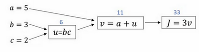
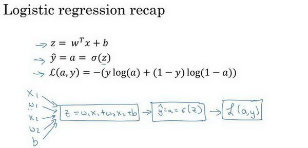

## 1. 逻辑回归

### 1.1  二分类

神经网络的训练过程可以分为前向传播和反向传播两个独立的部分

**1.  符号定义**

$x$：表示一个$n_x$维数据，为输入数据，维度为$(n_x,1)$； 

$y$：表示输出结果，取值为$(0,1)$；

$(x^{(i)},y^{(i)})$：表示第$i$组数据，可能是训练数据，也可能是测试数据，此处默认为训练数据； 

$X=[x^{(1)},x^{(2)},...,x^{(m)}]$：表示所有的训练数据集的输入值，放在一个 $n_x×m$的矩阵中，其中$m$表示样本数目; 

$Y=[y^{(1)},y^{(2)},...,y^{(m)}]$：对应表示所有训练数据集的输出值，维度为$1×m$。

**2. 输出函数**

为了训练逻辑回归模型的参数参数$w$和参数$b$我们，需要一个代价函数，通过训练代价函数来得到参数$w$和参数$b$。先看一下逻辑回归的输出函数：

${{y}^{(i)}}=\sigma({{w}^{T}}{{x}^{(i)}}+b)$，$where\quad\sigma(z)=\frac{1}{1+{{e}^{-z}}}$

$Given{(x^{(1)},y^(1),...,(x^{(m)},y^{(m)}))},want\quad\hat{y}\approx\hat{y} $

**3. 损失函数**

定义：**Loss function:$L\left( \hat{y},y \right)$.**

一般用预测值与真实值的平方差或者是平方差的一半，但是逻辑回归没有采用这种方式，因为当我们在学习逻辑回归参数的时候发现优化目标不是凸优化，只能找到多个局部最优解，因为我们定义另外一个损失函数：

我们在逻辑回归中用到的损失函数是：$L\left( \hat{y},y \right)=-y\log(\hat{y})-(1-y)\log (1-\hat{y})$

**4. 代价函数**

损失函数定义的是单个样本，为了衡量所有样本的表现，我们定义了代价函数是对$m$个样本的损失函数求和除以$m$

$J\left( w,b \right)=\frac{1}{m}\sum\limits_{i=1}^{m}{L\left( {{{\hat{y}}}^{(i)}},{{y}^{(i)}} \right)}=\frac{1}{m}\sum\limits_{i=1}^{m}{\left( -{{y}^{(i)}}\log {{{\hat{y}}}^{(i)}}-(1-{{y}^{(i)}})\log (1-{{{\hat{y}}}^{(i)}}) \right)}$

逻辑回归的代价函数有2个：

$w:=w-a\frac{\partial J(w,b)}{\partial w}$         $b:=b-a\frac{\partial J(w,b)}{\partial b}$

**5. 链式求导**

 

下面用到的公式：

$\frac{dJ}{du}=\frac{dJ}{dv}\frac{dv}{du}$  ，         $\frac{dJ}{db}=\frac{dJ}{du}\frac{du}{db}$ ，          $\frac{dJ}{da}=\frac{dJ}{du}\frac{du}{da}$

### 1.2 梯度下降

**1. 原理举例**

 

假设样本只有两个特征${{x}_{1}}$和${{x}_{2}}$，为了计算$z$，我们需要输入参数${{w}_{1}}$、${{w}_{2}}$ 和$b$，除此之外还有特征值${{x}_{1}}$和${{x}_{2}}$。因此$z$的计算公式为：

$z={{w}_{1}}{{x}_{1}}+{{w}_{2}}{{x}_{2}}+b$ 

回想一下逻辑回归的公式定义如下：
$\hat{y}=a=\sigma (z)$ ，其中：$z={{w}^{T}}x+b$  ，$\sigma \left( z \right)=\frac{1}{1+{{e}^{-z}}}$

损失函数：

$L( {{{\hat{y}}}^{(i)}},{{y}^{(i)}})=-{{y}^{(i)}}\log {{\hat{y}}^{(i)}}-(1-{{y}^{(i)}})\log (1-{{\hat{y}}^{(i)}})$ 

代价函数：

假设现在只考虑单个样本的情况，单个样本的代价函数定义如下：

$L(a,y)=-(y\log (a)+(1-y)\log (1-a))$ 

## 2. 神经网络

**激活函数的创新**

神经网络的一个重大突破，就是从 **sigmoid** 函数转换到一个 **RELU** 函数，在 **sigmoid** 函数的两端，梯度会下降到接近零，导致参数的更新很慢，所以学习的速度变得非常缓慢，而 **ReLU** 函数的梯度对所有的输入的负值都是零，因此，梯度更加不会趋向逐渐减至零。

 

### 2.1 浅层神经网络

### 2.2 生成神经网络

